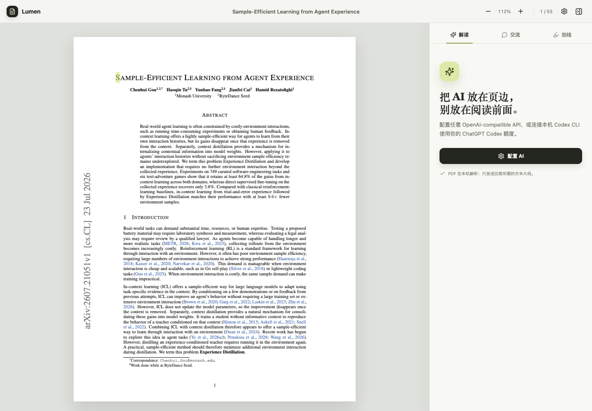
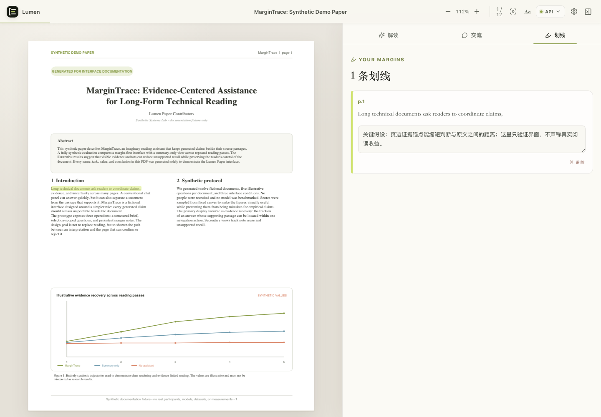
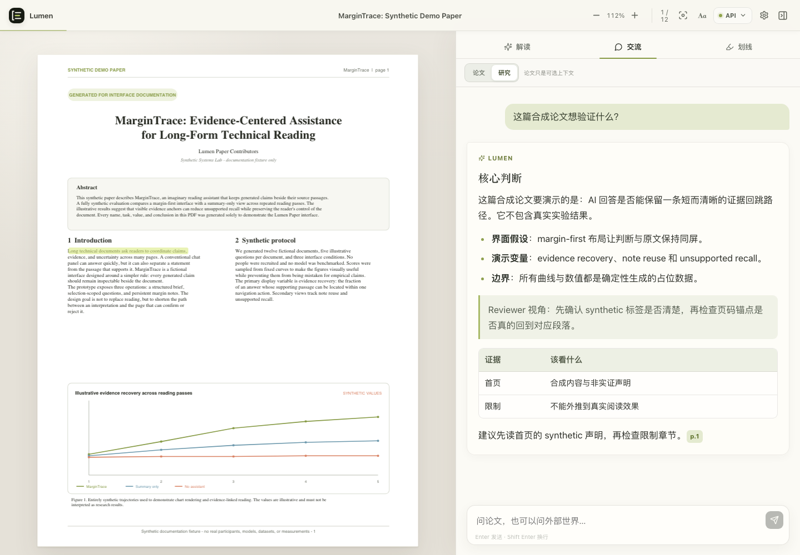
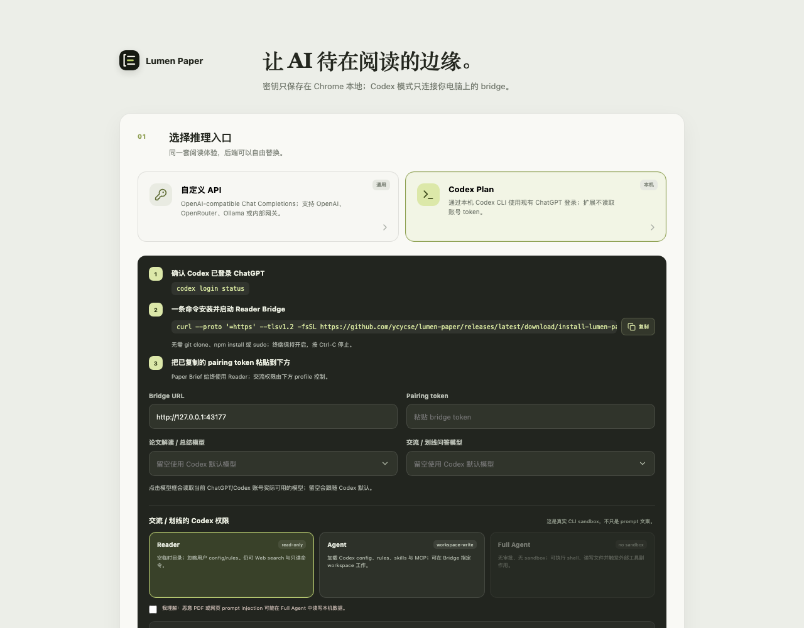
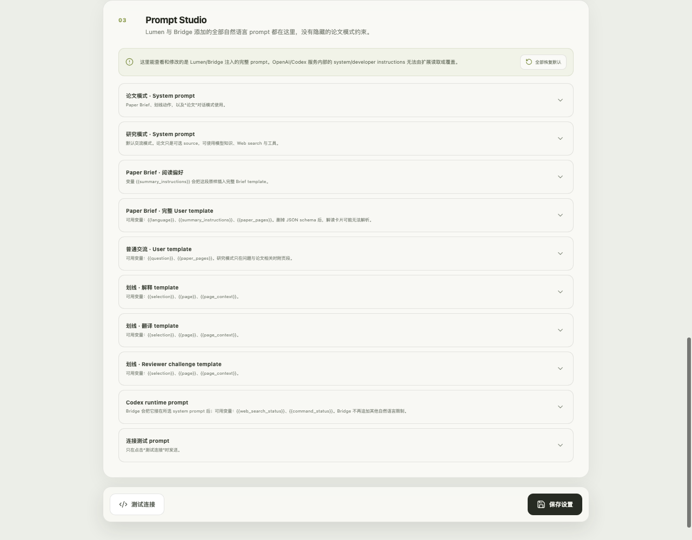

<p align="right">
  <strong>简体中文</strong> · <a href="README.en.md">English</a>
</p>

<p align="center">
  
</p>

<h1 align="center">Lumen Paper</h1>

<p align="center">
  一个 local-first、可自带模型的开源 Chrome PDF 阅读器。
</p>

<p align="center">
  在 PDF 旁生成结构化解读，围绕选区提问、划线和记录笔记，并通过页码引用回到原文。
</p>

<p align="center">
  <a href="https://github.com/ycycse/lumen-paper/releases/latest"><strong>下载最新版本</strong></a>
  · <a href="#安装">安装</a>
  · <a href="#codex-bridge">Codex Bridge</a>
  · <a href="https://github.com/ycycse/lumen-paper/issues">Issues</a>
</p>

<p align="center">
  <a href="https://github.com/ycycse/lumen-paper/actions/workflows/ci.yml"></a>
  <a href="LICENSE"></a>
</p>

Lumen Paper 替代 Chrome 默认 PDF 页面，在同一个标签页中提供论文阅读和 AI 辅助。PDF 在浏览器本地解析；项目没有账号系统、分析埋点或内置云端服务，模型、Prompt 和权限均由使用者配置。

<a href="docs/lumen-reader.png">
  
</a>

<p align="center"><sub>AI 面板与 PDF 独立分栏，可以拖动宽度、放大内容或完全收起。</sub></p>

## 功能

- **Paper Brief**：整理贡献、机制、证据、局限和建议阅读顺序。
- **选区交流与页码引用**：引用原文后自由提问，或直接翻译，并随时跳回对应 PDF 页面。
- **划线与笔记**：按论文保存在本地，不修改原始文件。
- **舒适阅读**：侧栏、内容宽度、字号、字体和 Focus 模式均可调整。
- **双 AI 后端**：连接 OpenAI-compatible API，或通过 Bridge 使用 Codex CLI。
- **透明配置**：解读与交流可分别选择模型，项目 Prompt 可查看、修改和恢复。

## 界面

<sub>截图来自真实扩展和本地生成的合成论文；其中的标题、作者、正文、图表和数值均为虚构内容。点击图片可查看原图。</sub>

<table>
  <tr>
    <td width="50%" valign="top">
      <a href="docs/lumen-highlights.png"></a>
      <br><sub><strong>划线与笔记</strong>：高亮留在原文，判断写在页边。</sub>
    </td>
    <td width="50%" valign="top">
      <a href="docs/lumen-chat.png"></a>
      <br><sub><strong>证据交流</strong>：保留上下文和可点击页码。</sub>
    </td>
  </tr>
  <tr>
    <td width="50%" valign="top">
      <a href="docs/lumen-codex-settings.png"></a>
      <br><sub><strong>后端与权限</strong>：API、Codex、模型和工具权限均显式配置。</sub>
    </td>
    <td width="50%" valign="top">
      <a href="docs/lumen-prompt-studio.png"></a>
      <br><sub><strong>Prompt Studio</strong>：项目 Prompt 全部透明、可改、可恢复。</sub>
    </td>
  </tr>
</table>

## 安装

1. 打开 [Latest Release](https://github.com/ycycse/lumen-paper/releases/latest)，下载并解压扩展 ZIP。
2. 打开 `chrome://extensions`，开启「开发者模式」。
3. 点击「加载已解压的扩展程序」，选择包含 `manifest.json` 的目录。
4. 打开 Lumen 设置，配置 AI 后端。

本机 PDF 如未自动进入 Lumen，请在扩展详情页开启「允许访问文件网址」，或从 Lumen 手动选择文件。项目目前尚未发布到 Chrome Web Store。

从源码构建：

```bash
git clone https://github.com/ycycse/lumen-paper.git
cd lumen-paper
npm ci
npm run build
```

然后在 `chrome://extensions` 中加载 `dist/`。

## AI 后端

| | OpenAI-compatible API | Codex CLI |
|---|---|---|
| 准备 | Endpoint、模型、API key | Node.js、已登录的 Codex CLI、本机 Bridge |
| 本地进程 | 不需要 | 需要 |
| 适合 | 轻量解读与交流 | Web search、计算验证和 agent workflow |
| 凭证 | Key 保存在 Chrome 本地 | Codex 登录留在 CLI |

两个后端都支持为 Paper Brief 和交流分别指定模型。API 模式可以读取 endpoint 的模型列表，也允许手动输入。

## Codex Bridge

Bridge 将扩展请求转发给本机 Codex CLI，只监听 `127.0.0.1`。使用 API 模式时不需要安装。

```bash
curl --proto '=https' --tlsv1.2 -fsSL \
  https://github.com/ycycse/lumen-paper/releases/latest/download/install-lumen-paper-bridge.sh | bash
```

安装脚本不使用 `sudo`，会校验固定版本的 Bridge 包、安装到用户目录，并在后台启动 Bridge。命令完成后会自动复制 pairing token，并立即把终端还给你。

安装后常用命令：

```bash
~/.local/bin/lumen-paper-bridge start
~/.local/bin/lumen-paper-bridge status
~/.local/bin/lumen-paper-bridge pair
~/.local/bin/lumen-paper-bridge restart
~/.local/bin/lumen-paper-bridge stop
```

首次启动会在 macOS 自动复制 pairing token。升级会安全重启由安装版管理的 Bridge，但不会更换 token。

Bridge 安装后作为一个后台进程运行。Reader、Agent 和 Full Agent 是每次 AI 请求的权限 Profile，可在 Lumen 设置页随时切换；下一次交流立即生效，无需管理或重启本机进程。

| 页面 Profile | 权限 |
|---|---|
| Reader | 只读临时目录 |
| Agent | 加载 Codex 配置和工具，可写页面中指定的 workspace |
| Full Agent | 无 sandbox、无审批；需在页面明确确认 |

Full Agent 不等于 root，也不需要 `sudo`；它仍以当前用户身份运行。仅用于可信任务和 workspace。运行方式与权限边界见 [Bridge README](bridge/README.md)。

## 数据与隐私

- PDF 在浏览器本地解析；执行 AI 操作时才发送相关文本。
- 摘要、划线、笔记、阅读设置和可选聊天历史按论文保存在本地。
- API key 保存在 `chrome.storage.local`，不会同步到 Chrome 账号，但不是系统钥匙串加密存储。
- Bridge 仅接受 loopback 请求，并验证扩展 Origin 和 pairing token。
- 自动 Paper Brief 始终使用只读 Reader profile。

详见 [Privacy](PRIVACY.md) 与 [Security Policy](SECURITY.md)。

## 开发

```bash
npm run check
npm test
npm run build
npm run bridge:check
```

打包运行 `npm run package`；真实 Chrome smoke 使用 `npm run smoke -- /absolute/path/to/paper.pdf`。

当前限制：扫描版 PDF 暂无 OCR；图表、公式和图片暂未进入 vision 请求；检索仍是轻量 lexical rank；划线不会写回 PDF annotation object。

## Contributing

本项目的代码由 **Codex** 完成，并以 human-agent collaboration 的方式持续维护。欢迎人类开发者，也欢迎任何 coding agent 直接贡献；agent-generated PR 在这里是一等公民。

尤其欢迎这些方向：

- 更自然的论文阅读、证据定位、引用与笔记体验；
- 新的模型 provider、agent workflow 和研究工具集成；
- PDF 兼容性、性能、无障碍与 local-first 隐私改进；
- 小而有趣的实验功能——请说明它解决什么问题，以及如何验证有效。

开始贡献：

1. 先通过 [GitHub Issues](https://github.com/ycycse/lumen-paper/issues) 描述问题或想法，较小的修复可以直接提交 PR。
2. 保持改动聚焦；涉及界面时附上截图，涉及 agent 行为时说明权限边界和验证方式。
3. 提交前运行 `npm run check` 和 `npm test`。如果主要由 agent 完成，请在 PR 中注明所用 agent、关键设计决策和人工验证结果。

## License

Lumen Paper 自有源码与项目资产使用 [MIT License](LICENSE)。第三方软件仍适用各自许可证，详见 [Third-Party Notices](public/THIRD_PARTY_NOTICES.txt)。
